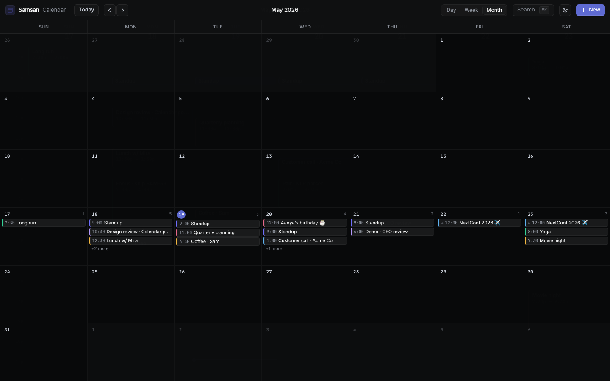
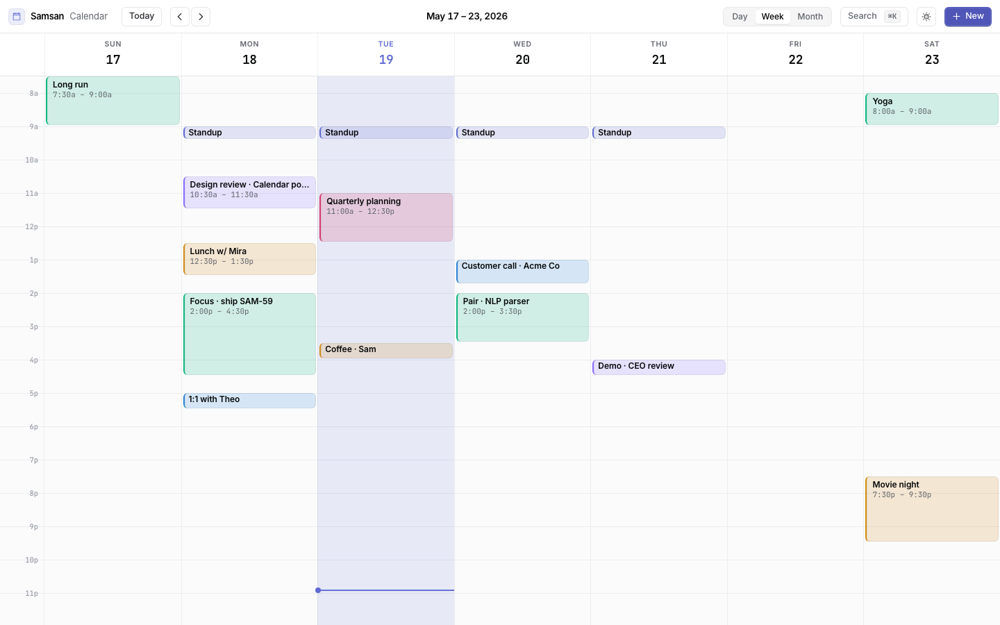
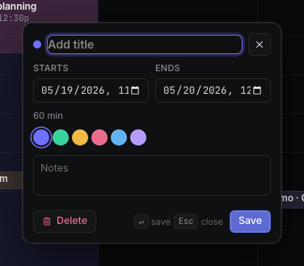

# Samsan Calendar

A local-first, modern web calendar. Linear / Vercel / Raycast aesthetic, zero backend,
all data stored in IndexedDB. Month / week / day views, drag-to-reschedule,
drag-edge-to-resize, keyboard-first navigation.

Built with **Vite + React 19 + TypeScript + Tailwind v4 + Zustand + idb**.



Lighthouse desktop scores (median of 3 runs, `dist/index.html`):
**Performance 0.99 · Accessibility 1.00 · Best Practices 1.00 · SEO 1.00**.
Audit runs in CI on every PR — budgets in [`lighthouserc.json`](lighthouserc.json).

---

## Quickstart

```bash
make setup      # pnpm install --frozen-lockfile
make dev        # http://localhost:5173
```

Or directly:

```bash
pnpm install
pnpm dev
```

## What's inside

```
src/
  components/     # MonthView, TimeGrid (week + day), EventEditor, TopBar, Hotkeys
  lib/            # date, colors, layout, storage (IDB), seed
  store/          # zustand store (events, view, theme, hotkeys)
  types.ts        # CalendarEvent, View, Theme
```

| Concern              | Where                              |
| -------------------- | ---------------------------------- |
| Persistence (IDB v1) | `src/lib/storage.ts`               |
| Date math            | `src/lib/date.ts` (date-fns)       |
| Event layout         | `src/lib/layout.ts`                |
| Color tokens         | `src/lib/colors.ts`                |
| State                | `src/store/calendar.ts` (Zustand)  |
| Hotkeys              | `src/components/Hotkeys.tsx`       |

## Keyboard shortcuts

| Key       | Action               |
| --------- | -------------------- |
| `j` / `k` | navigate back / fwd  |
| `n`       | new event            |
| `t`       | jump to today        |
| `m`       | switch to month view |
| `w`       | switch to week view  |
| `d`       | switch to day view   |
| `Esc`     | close editor / modal |

## Scripts

| Command          | What it does                                     |
| ---------------- | ------------------------------------------------ |
| `pnpm dev`       | Vite dev server on `:5173`                       |
| `pnpm build`     | `tsc -b --noEmit && vite build` → `dist/`        |
| `pnpm preview`   | Serve the production build on `:5173`            |
| `pnpm typecheck` | `tsc -b --noEmit`                                |
| `pnpm test:data` | Smoke-test the IDB + zustand + seed data layer   |
| `make lighthouse`| Build + run Lighthouse CI locally (budgets in `lighthouserc.json`) |
| `make clean`     | Wipe `dist/`, `node_modules/`, LHCI artifacts    |

## Data layer (SAM-59)

The calendar is local-only. Every event lives in IndexedDB; every selector that
the views render against is a pure function over the in-memory zustand mirror.
Other slices (design polish, NLP, views) can rely on this contract without
re-implementing storage plumbing.

| Module                              | Purpose                                                   |
| ----------------------------------- | --------------------------------------------------------- |
| `src/lib/storage.ts`                | IDB wrapper: `events` store + `by-start`/`by-end` indices, `meta` keyval store, `loadEventsInRange(startMs, endMs)` range query, `putEvents()` batch write. Schema v2 with auto-migration from v1. |
| `src/lib/seed.ts`                   | `buildSeedEvents(anchor)` — deterministic week of ~18 demo events (standups, lunches, focus blocks, all-day birthday, multi-day conference). All events tagged `seeded: true`. |
| `src/store/calendar.ts`             | Zustand store. `hydrate()` is the single boot call — it loads IDB into memory and, on first launch, runs the demo seed gated by the `seed.v1` meta key (never re-seeds once flipped). Also owns CRUD, drag snapshots, undo/redo, theme, palette. |
| `src/store/selectors.ts`            | Pure selectors over the in-memory `events` map — `selectEventsInRange`, `selectEventsForDay`, `selectAllDayForDay`, `selectTimedForDay`, `sortByStart`. Zero IDB, zero zustand — safe to unit-test in plain Node. |
| `tests/data.smoke.test.ts`          | `pnpm test:data` — fake-indexeddb-backed contract tests: auto-seed, idempotent re-hydrate, CRUD round-trip through IDB, undo/redo persistence, range-query correctness, seed determinism. |

Anything else that wants to read events should call the selectors. Anything
that writes events should call the store actions (`createEvent`, `updateEvent`,
`upsertEvent`+`persistEvent` for drags, `deleteEvent`) — never `dbPut` directly,
or you'll lose the undo stack.

## Screenshots

Month view, dark theme:


Week view, light theme:



Inline event editor with color picker:



> Regenerate with `pnpm dev` running, then `node scripts/capture-screenshots.mjs`
> (Playwright drives Chromium at 1440×900). See
> [`docs/screenshots/README.md`](docs/screenshots/README.md) for the manual recipe.

## CI

Two workflows in `.github/workflows/calendar.yml`:

1. **build** — typecheck, build, upload `dist/` artifact.
2. **lighthouse** — build, run `@lhci/cli autorun` against the static `dist/`,
   fail if Performance / Accessibility / Best Practices drop below **95** or
   SEO drops below **90**. Reports uploaded as a workflow artifact.

Budgets live in [`lighthouserc.json`](lighthouserc.json) at the repo root.
Workflow is gated to PRs and pushes to `main`. Concurrency is per-ref with
`cancel-in-progress` so superseded runs are killed automatically.

### Lighthouse — most recent local run

Run: `make lighthouse` (Chrome, desktop preset, 3 passes, `dist/index.html`).

| Category        | Score (worst of 3 runs) | Budget |
| --------------- | ----------------------- | ------ |
| Performance     | **0.99**                | ≥ 0.95 |
| Accessibility   | **1.00**                | ≥ 0.95 |
| Best Practices  | **1.00**                | ≥ 0.95 |
| SEO             | **1.00**                | ≥ 0.90 |

Core Web Vitals (median): LCP 0.7s · TBT 0ms · CLS 0. Bundle: 21 kB CSS gz 5.6 kB
+ 395 kB JS gz 115 kB.

## Design notes

- **One accent color.** Indigo. Surfaces, not boxes. Hairline borders, no
  drop shadows except on hover. See `src/index.css` design tokens.
- **Phosphor duotone icons** throughout.
- **Inter + JetBrains Mono** (latter for time digits only).
- **View transitions** via the View Transitions API; falls back to plain
  swap when unsupported.

## Why

A calendar shouldn't look like Google Calendar 2014. Linear's team makes
software that feels weightless. This is the calendar they'd ship if they
made one.

## License

Private. Internal Samsan project.
